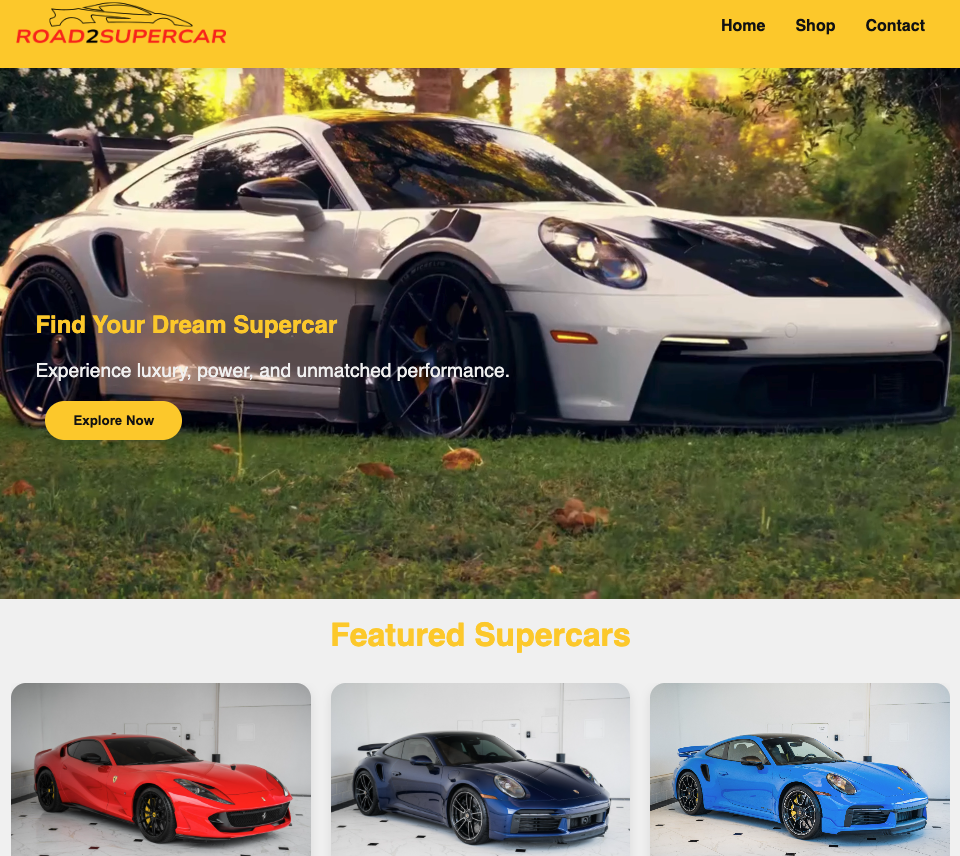

# Road2Supercar Ecommerce

Welcome to Road2Super Shop, a sleek and easy-to-use online platform where you can explore and shop for some of the world’s most powerful and luxurious supercars. The website is designed to be fast, simple, and fully responsive, ensuring a smooth experience whether you're browsing on a phone, tablet, or desktop.

- -> Try it online: https://main.d3s91fm4pflf76.amplifyapp.com/

---

## Features
- Browse a curated selection of high-end supercars from top global brands.
- View key vehicle details including title, description, price, and images.
- Fully responsive design — looks and works great on any device.
- Uses a JSON file for product listings, preventing hard-coding and making it easy to update or add new cars (title, description, price, image).
- Simple and user-friendly interface

---

## Installation & Usage
1. git clone git@github.com:MassowNdiaye/Ecommerce-V1.git
2. open index.html 
3. Shop your Supercar!

- -> Use it without installing: https://main.d3s91fm4pflf76.amplifyapp.com/